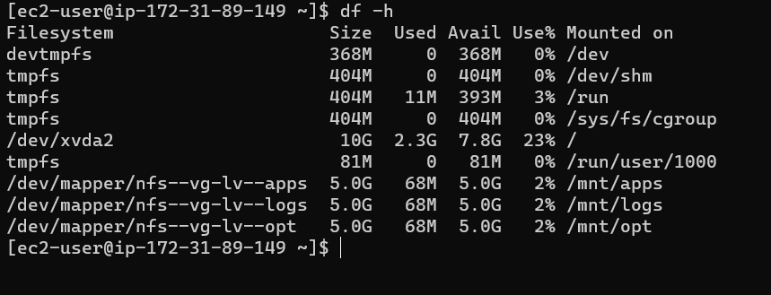
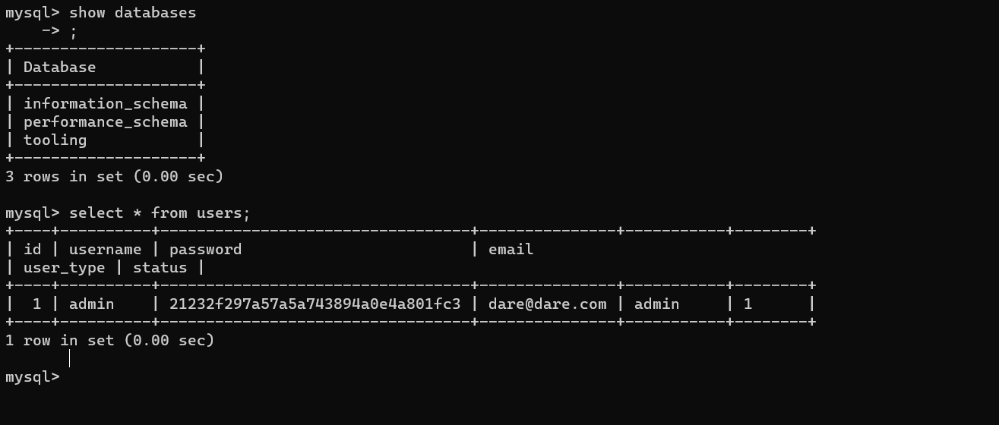
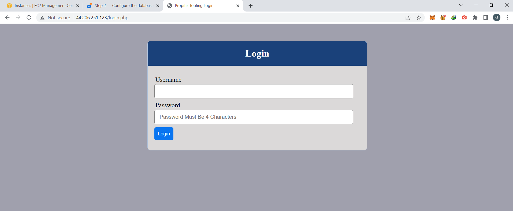
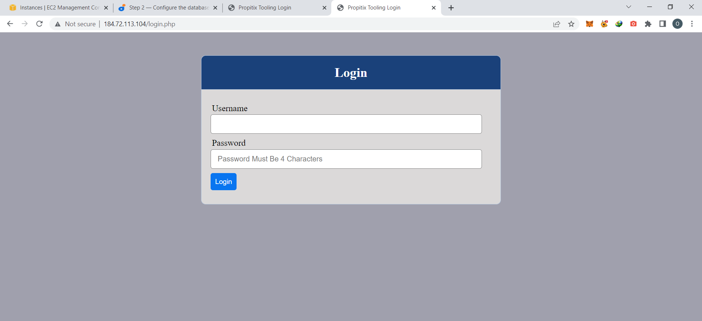

# IMPLEMENTATION OF PROJECT7

## STEP 1 
## Prepare nfs server

1. Launch a RHEL 0S EC2 instance and create two additional volumes
2. Configure LVM on the server

Run the following commands to configure LVM
  
  `lsblk`

`sudo gdisk /dev/xvdb`

`sudo yum install lvm2`

`sudo pvcreate /dev/xvdb1 /dev/xvdc1`

`sudo vgcreate nfs-vg /dev/xvdb1 /dev/xvdc1`

`sudo vgdisplay`

`sudo lvcreate -n lv-apps -L 5G nfs-vg`

`sudo lvcreate -n lv-logs -L 5G fs-vg`

`sudo lvcreate -n lv-opt -L 5G nfs-vg`

`sudo mkdir /mnt/apps /mnt/logs /mnt/opt`

`sudo mkfs.xfs /dev/nfs-vg/lv- apps`

`sudo mkfs.xfs /dev/nfs-vg/lv-logs`

`sudo mkfs.xfs /dev/nfs -vg/lv-opt`

3. 

Create mount points on /mnt directory for the logical volumes as follow:

Mount 1v-apps on /mnt/apps - To be used by webservers 

Mount lv-logs on /mnt/logs - To be used by webservers logs

Mount lv-opt on /mnt/opt - To be used by Jenkins server in Project 8

`sudo mount /dev/nfs-vg/lv-apps /mnt/apps/`

`sudo mount /dev/nfs-vg/lv- logs /mnt/logs/

`sudo mount /dev/nfs-vg/lv-opt /mnt/opt/

Run `sudo blkid /dev/nfs-vg/*` then copy the uiud in the /etc/fstab/ file
and copy the UIUD in the '/etc/fstab/ file

Then run `sudo mount -a` and `df -h` to confirm

4. 
Install NFS server, configure it to start on reboot

`sudo yum -y update`

`sudo yum install nfs-utils -y`

`sudo systemctl start nfs-server.service`

`sudo systemctl enable nfs-server.service`

`sudo systemctl status nfs-server.service`

5.

Export the mounts for webservers' subnet cidr to connect as clients.

6.

 Set up permissions to allow webservers to read write and execute files

`sudo chown -R nobody: /mnt/apps`

`sudo chown -R nobody: /mnt/logs`

`sudo chown -R nobody: /mnt/opt`

`sudo chmod -R 777 /mnt/apps`

`sudo chmod -R 777 /mnt/logs`

`sudo chmod -R 777 /mnt/opt`

7.
Restart the nfs server

`sudo systemctl restart nfs-server.service`

8.

sudo vi /etc/exports

`/mnt/apps <Subnet-CIDR>(rw,sync,no_all_squash,no_root_squash)`

`/mnt/logs <Subnet-CIDR>(rw,sync,no_all_squash,no_root_squash)`

`/mnt/opt <Subnet-CIDR>(rw,sync,no_all_squash,no_root_squash)`

`sudo exportfs -arv`

9.

Check which port is used by NFS and open it using Security Groups (add new Inbound Rule)

`rpcinfo -p | grep nfs`

## CONFIGURATION OF DATABASE

1. Launch an Ubuntu Linux 0S EC2 instance

2. Install mysql server

`sudo apt install mysql`

3. Create a database and name it tooling

`sudo mysql`

`create database tooling;`

4. Create a database user and name it webaccess

`create user 'webaccess'@'%' identified with mysql_native_password by 'password';`

5. Grant permission to webaccess user on tooling database to do anything only from the webservers subnet cidr

`grant all privileges on tooling.* to 'webaccess '@'%'`

`flush privileges;`

`exit`

6. Edit the bind address

`sudo vim /etc/mysql/mysql.conf.d/mysqld.cnf`

7. Restart mysql

`sudo systemctl restart mysql"`

## PREPARING THE WEBSERVERS

Launch a 2 new EC2 instance with RHEL 8 Operating System

2. Edit inbound rule in the security group and add port 80

3. Install NFS client

`sudo yum install nfs-utils nfs4-acl-tools -y`

4. Mount /var/www/ and target the NFS server's export for apps

`sudo mkdir /var/www`

`sudo mount -t nfs -o rw,nosuid <NFS-Server-Private-IP-Address>:/mnt/apps var/www`

5. Verify that NFS was mounted successfully by running df -h.

`df -h`

`sudo vi /etc/fstab`

`<NES-Server-Private-IP-Address>:/mnt/apps /var/wwM nfs defaults 0  0`

6. Install Remi's repository, Apache and PHP

`sudo yum install httpd -y`

`sudo dnf install https://dl.fedoraproject.org/pub/epel/epel-release-latest-8.noarch.rpm`

`sudo dnf install dnf-utils http://rpms.remirepo.net/enterprise/remi-release-8.rpm`

`sudo dnf module reset php`

`sudo dnf module enable php:remi-7.4`

`sudo dnf install php php-opcache php-gd php-curl php-mysqlnd`

`sudo systemctl start php-fpm`

`sudo systemctl enable php-fpm`

`setseboo1 -P httpd_execmem 1`

7. Verify that Apache files and directories are available on the Web Server in /var/www and also on the NFS server in /mnt/apps.

`cd /var/www/html`

`touch proj`

`echo World >> proj`

`ls`

`rm proj`

8. 
Fork the tooling source code from Darey.io Github Account to your Github account.

`sudo yum install git`

`git clone https://github.com/darey-io/tooling. git`

`ls`

`cd tooling`

`ls`

9
Deploy the tooling website's code to the Webserver. Ensure that the html folder from the repository is deployed to /var/www/html

`cd ..`

`mv tooling/* .`

`ls`

`ls tooling`

`sudo rm -r tooling`

`mv ./html/* .`

`ls`

`sudo rm -r html`

`ls`

`sudo yum install mysql`

10 
Update the website's configuration to connect to the database (in /var/www/html/functions.php file)

`vi functions . php`

11

 Apply tooling-db.sql script to your database using this command mysql -h <database -private-ip> -u <db-username> -p <db-pasword> < tooling-db.sql

`mysql -u webaccess -p password -h <database-private-ip`

`mysql -u webaccess -p password -h <database-private-ip> tooling < tooling- db.sql`

`show databases`

`select * from users;`

12. 
Disable SELinux sudo setenforce 0. To make this change permanent - open following
config file 'sudo vi /etc/sysconfig/sel inux' and set SELINUX=disabled then restrt httpd.

`sudo setenforce 0`

13. Open the website in your browser http://
<Web-Server -Public-IP-Address -or - Public - DNS - Name> /index. php and make sure you can login
into the website with "myuser" user

